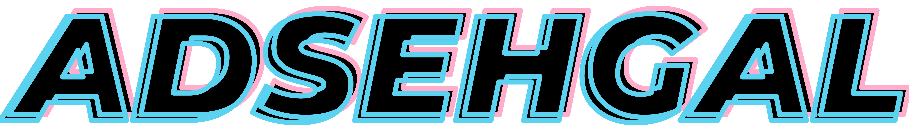

<!--  -->

# \*\*

## _Requirements:_

-

## Built With

- [KiCad](https://kicad-pcb.org/) - Schematic capture and layout
- [VS Code](https://code.visualstudio.com/) - Used to develop firmware
- [Fusion 360](https://www.autodesk.com/education/edu-software/overview) - Used to design 3-D models for packages

### _Notes:_

## Authors

- **Aditya Sehgal** - _PCB Layout, Firmware, 3-D Modelling_ - [Adsehgal](https://github.com/adsehgal)
